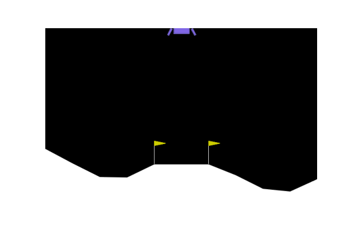

### <div align='center'> Evolutionary Algorithms - CS4205 <br/> 16-01-2023 </div>

# <div align='center'> Genepromulti </div>
#### <div align='center'><i>Forked project about evolving the Lunar Lander with EAs and Gradient-Based Optimisation </i></div>


### <div align ='center'> Group 011:</div>
#### <div align='center'>Ben Jacobs: 4713761 </br> Caspar Meijer: 4719298 </br> David Janssen: 4731268 </br> Marijn de Rijk: 4888871 </br> Jurjen Scharringa: 4708652  </div>
This project is made for the group assignment of the course EA4205 at the TU Delft. 
The aim of this project is to evolve the Lunar Lander problem using Evolutionary Algorithms and Gradient Based Optimisation. First a baseline is constructed, then multiple hypotheses are drawn up to improve the performance of this baseline. This project is forked from the original [genepromulti](https://github.com/matigekunstintelligentie/genepromulti) project. 

This file will contain the following contents:
- Content description
- Installation guide
- Results

## Content description
The repository consists of the following python files with corresponding descriptions:
- ```solution.ipynb```: The main solution notebook. Changes were added
- ```genepro/evo.py```: Evolution file responsible for the evolution. No changes were made here.
- ```genepro/multitree.py```: Multitree file responsible for constructing the multitree. No changes were made here.
- ```genepro/node_impl.py```: Node implementations file. No changes were made here.
- ```genepro/node.py```: Node file. No changes were made here. 
- ```genepro/scikit.py```: Scikit file. No changes were made here.
- ```genepro/selection.py```: Selection file for selection method. Changes were added from # ADDED SELECTION FUNCTIONS
- ```genepro/util.py```: Utilisation file. No changes were made here.
- ```genepro/variation.py```: Variation file. Changes were added between. 
- ```genepro/visualization.py```: Visualization file for plotting the results. This file was created by us.
- ```genepro/thruster_symmetry.py```: File containing function for swapping out selected feature nodes to achieve symmetry (as explained above). This file was created by us.

The repository consists of the following directories:
- coefficient_optimization: Contains the pickle files and result of the optimisation experiment.
- experiments: Contains the pickle files and results of baseline experiments, fitness experiments and symmetry experiments.
- plot: Contains the plots for various experiments.
- selection_experiments: Contains the pickle files and results of the selection method experiments.

 
## Installation guide
The following pre-requisites are required:
- Python >3.6, <3.10
- git

Then, the repository needs to be downloaded into a directory of choice:
```
git clone https://github.com/Capsar/genepromulti.git
```
Install the required dependencies by following these steps:

> **_NOTE:_**  Conda does not show a progress bar.  The size of the needed packages is quite large, meaning you may have to wait a while for all the packages to load.


- navigate to the folder in which you installed the repository: ``cd PATH/TO/REPOSITORY``
- Create new conda environment: 
     - Windows: ```conda env create --name EA_group11 -f requirements.txt```
     - Linux: `conda env create -f requirements_linux.txt`
- Activate the new conda environment ```conda activate EA_group11```

## Results
The GIFs below show the results of various experiments done within this project. 


Result of baseline


Result of symmetry experiment


Result of coefficient optimisation experiment

